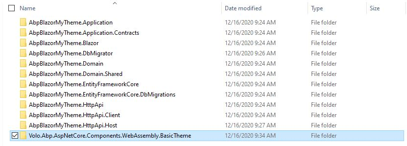
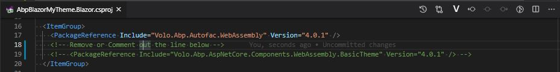
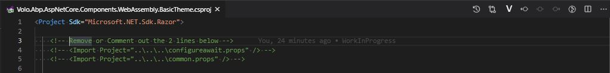
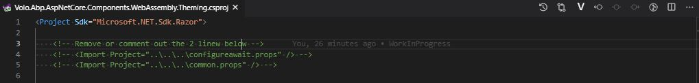
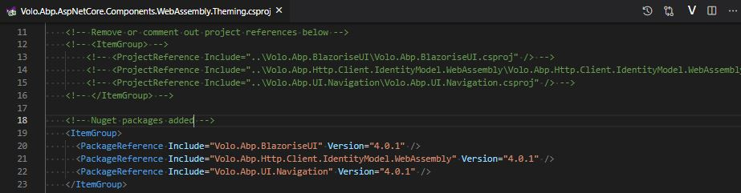
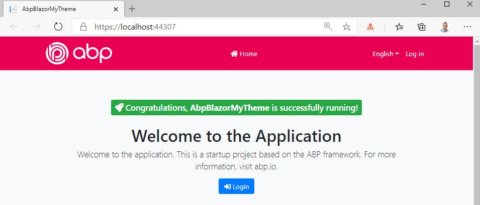

## Creating a new UI theme by copying the Basic Theme (for Blazor)

## Introduction

In this article, I will show you how to create a new UI theme in a **Blazor APB application** by copying the **Basic Theme** and make some changes to it.

The sample application in this **GitHub** repository has been developed with **Blazor** as UI framework and **SQL Server** as database provider.

### Source Code

Source code of the completed application is [available on GitHub](https://github.com/bartvanhoey/AbpBlazorMyTheme).

## Requirements

The following tools are needed to be able to run the solution.

* .NET 5.0 SDK
* VsCode, Visual Studio 2019 16.8.0+ or another compatible IDE

## Development

### Creating a new Application

* Install or update the ABP CLI:

```bash
dotnet tool install -g Volo.Abp.Cli || dotnet tool update -g Volo.Abp.Cli
```

* Use the following ABP CLI command to create a new Blazor ABP application:

```bash
abp new AbpBlazorMyTheme -u blazor
```

### Open & Run the Application

* Open the solution in Visual Studio (or your favorite IDE).
* Run the `AbpBlazorMyTheme.DbMigrator` application to apply the migrations and seed the initial data.
* Run the `AbpBlazorMyTheme.HttpApi.Host` application to start the server side.
* Run the `AbpBlazorMyTheme.Blazor` application to start the Blazor UI project.

## Copy Components.WebAssembly.BasicTheme and Components.WebAssembly.Theming project to the src folder of your project

Open a command prompt and clone the [apb repository](https://github.com/abpframework/abp) into your computer.

```bash
   git clone https://github.com/abpframework/abp
```

Once the cloning is done, navigate to the `framework\src` folder of the repository and copy both the `Volo.Abp.AspNetCore.Components.WebAssembly.BasicTheme` and `Volo.Abp.AspNetCore.Components.WebAssembly.Theming` projects into the `src` folder of your project.



## Remove the Package Reference of the Basic Theme in the Blazor project

Open the `[YourProjectName].Blazor.csproj` file and remove or comment out the line below.

```bash
   <PackageReference Include="Volo.Abp.AspNetCore.Components.WebAssembly.BasicTheme" Version="4.0.1" />
```



## Build the Volo.Abp.AspNetCore.Components.WebAssembly.BasicTheme project and fix errors

Open file **Volo.Abp.AspNetCore.Components.WebAssembly.BasicTheme.csproj** and remove or comment out the following lines.



Open file **Volo.Abp.AspNetCore.Components.WebAssembly.Theming.csproj** and do the same



Open a command prompt in the **WebAssembly.Theming** project and add nuget packages needed by the commands below.

```bash
   dotnet add package Volo.Abp.BlazoriseUI
   dotnet add package Volo.Abp.Http.Client.IdentityModel.WebAssembly
   dotnet add package Volo.Abp.UI.Navigation
```

Remove or comment out the project references. See image below.



## Add project reference to the BasicTheme project in the Blazor.csproj file

Open a command prompt in the Blazor project of your application and enter the command below to add a project reference.

```bash
   dotnet add reference ../../src/Volo.Abp.AspNetCore.Components.WebAssembly.BasicTheme/Volo.Abp.AspNetCore.Components.WebAssembly.BasicTheme.csproj
```

## Add some custom style to the BasicTheme project

Open file **theme.css** in the **Volo.Abp.AspNetCore.Components.WebAssembly.BasicTheme** and add following css classes.

```html
   .bg-dark{
      background-color: #e90052 !important;
   }

   .home-logo {
      width: 120px;
   }
```

Create an **assets** folder to the **wwwroot** folder of the **Blazor** project and copy/paste the **abp logo** in the **assets** folder. 
You can find a copy of the logo [here](https://github.com/bartvanhoey/AbpBlazorMyTheme/blob/gh-pages/src/AbpBlazorMyTheme.Blazor/wwwroot/assets/abp-logo-light.svg).

Open file **Branding.razor** in the **BasicTheme** project and update with the code below

```html
   @using Volo.Abp.Ui.Branding
   @inject IBrandingProvider BrandingProvider
   @* <a class="navbar-brand" href="">@BrandingProvider.AppName</a> *@
   <a class="navbar-brand" href="https://abp.io/"></a>
```

## Run both the [YourProjectName].Blazor and [AbpBlazorMyTheme].HttpApi.Host project

Et voilà! This is the result.



You can now modify the theme, add your custom css/js files, or your custom ViewComponents, etc.

Find more about adding global styles/scripts and other fundamentals about ABP theming [here](https://docs.abp.io/en/abp/latest/UI/AspNetCore/Theming).

Get the [source code](source code) on GitHub.

Enjoy and have fun!